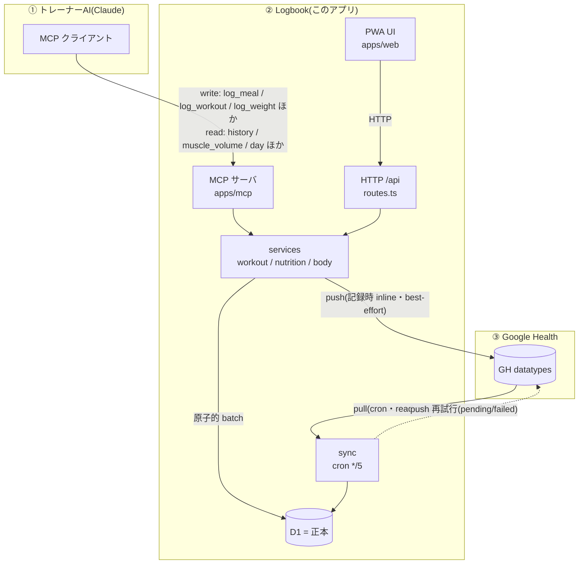

# Logbook — Google Health sidecar(ボディメイク記録)

単一ユーザー(オーナー本人)向けの、ジム・ボディメイク記録 PWA。**食事とワークアウトはこのアプリが authoring 元(D1 が真実)**、体重・睡眠などのセンシングは Google Health が真実で daily batch で同期(表示)する二層構成。

> 設計の全体像は [`docs/design.md`](docs/design.md)(v3)、UX方針は [`docs/ux-review.md`](docs/ux-review.md)、GH API 調査は [`docs/research-appendix.md`](docs/research-appendix.md)。

## スタック

- **Cloudflare Workers + D1 + KV**(Cron でデイリーバッチ)
- **React 19 + Vite + @cloudflare/vite-plugin**(SPA と Worker API を1プロジェクトで同居)
- Tailwind v4 / TanStack Query / lucide / recharts / react-body-highlighter
- **Hono**(API + 認証ゲート) / Google OIDC(系統A ログイン)+ GH OAuth Pattern B(系統B, **接続済・daily pull / push 稼働**)
- pnpm workspace モノレポ: `packages/core`(ドメイン/DB/services/providers/auth) + `apps/web`(UI+API) + `apps/mcp`(**MCP サーバ, 21ツール・本番稼働・claude.ai 接続済**) + `tools`(OAuth CLI / probe)

## データフロー(トレーナーAI / Logbook / GH)

**D1 が唯一の正本**。食事・ワークアウト・体重は **UI(PWA)とトレーナーAI(MCP)の両方**から書け、保存と同時に GH へ best-effort で push する。体重・睡眠などのセンシングは GH デバイスが真実で、cron が pull して表示する。**食事・ワークアウトは GH から pull しない**(app/MCP→GH の一方向。pull すると二重取込になるため)。



### データ種別ごとの流れ(現状の実装)

| データ | 入力元 | D1 正本 | GH push | GH pull |
|---|---|---|---|---|
| ワークアウト | UI / MCP(`log_workout`) | ✓ `workout_sessions` | ✓ `exercise`(STRENGTH_TRAINING) | ✗ |
| 食事 | UI / MCP(`log_meal`/`log_preset`/`log_meal_photo`) | ✓ `meals` | ✓ `nutrition-log` ※フラグ依存 | ✗(一方向) |
| 体重・体脂肪 | UI / MCP(`log_weight`)/ GHデバイス | ✓ `body_metrics` | ✓ `weight` / `body-fat` | ✓(デバイス測定) |
| 睡眠 | GH デバイス | ✓ `sleep_logs` | ✗ | ✓ read-only |
| 安静時心拍 / HRV / SpO₂ / VO₂max / 呼吸数 | GH デバイス | ✓ `daily_metrics` | ✗ | ✓ read-only |
| 歩数 / 消費kcal | GH デバイス | ✓ `daily_metrics`(`steps`/`active_energy_kcal`) | ✗ | ✓ **配線済**(分単位 interval を日次合算, migration 0014) |
| 皮膚温 | GH デバイス | — | ✗ | ✗ **恒久除外**(GH 未提供=候補8種すべて Invalid) |
| 食事プリセット / 栄養目標 | UI / MCP | ✓ | ✗ | ✗ |

- ※ 食事の GH push は **`FEATURE_GH_NUTRITION_PUSH`**(本番 = `true`)が ON のときだけ実行。OFF だと台帳に `skipped_flag_off` で記録され push されない。
- push は失敗しても D1 には残る(best-effort)。`gh_sync_state` 台帳が `pending → synced / failed → dead_letter`(403/401/400 は恒久失敗)を追跡し、cron が再試行する。冪等性は `client_request_id` で担保。

### 同期(cron `*/5` — `apps/web/src/index.ts`)

毎5分ごとに順に実行:

1. **stale 化** — 放置された `in_progress` セッションを `stale` に倒す
2. **pull(GH→D1)** — 体重/体脂肪/睡眠/安静時心拍/HRV/SpO₂/VO₂max/呼吸数を取り込み(自分の push 由来は `gh_external_id` で除外しエコーを防止)
3. **毎 `*/5`** — 歩数・消費kcal(分単位 interval)を当日分まで日次合計に上書き(pageSize 拡大で軽量化済。早朝7時のみ3日分再集計)
4. **push 再試行** — 失敗/未送の GH push を最大 20 件再送

> ユーザー期待の「食事をトレーナーAIが入力 → MCP → Logbook(D1)→ GH」は `log_meal` で実装済み(GH 反映は `FEATURE_GH_NUTRITION_PUSH` 依存)。ワークアウト・体重も同様に **MCP / UI のどちらからでも D1 + GH** へ入る。逆に睡眠・心拍などは GH 由来の read-only。

## ローカル起動

```bash
pnpm install
# D1 スキーマ + seed を local に適用(初回)
pnpm --filter @ghs/web exec wrangler d1 migrations apply ghsidecar --local
# 開発サーバ(SPA + /api 同居)。http://localhost:5173
pnpm --filter @ghs/web dev
```

`apps/web/.dev.vars`(gitignore 済)に `DEV_AUTH_BYPASS=1` があるとローカルはログイン不要で動く。`GOOGLE_CLIENT_ID/SECRET`・`SESSION_SIGNING_KEY` も同ファイル。

## 検証

```bash
pnpm -r --if-present typecheck   # 型(core/web/mcp/tools)
pnpm --filter @ghs/core test      # vitest(単位/metrics/GH mapper)
pnpm exec biome check .           # lint/format
pnpm --filter @ghs/web build      # vite build(client + worker)
```

## 実装状況

- **M0(完了)**: モノレポ基盤、ドメイン/metrics、D1スキーマ、HealthProvider抽象 + GH v4 provider(discovery doc 準拠)、db層、auth(Pattern B)、OAuth CLI。
- **M1(完了)**: services層(全write一点経由)、/api + 認証ゲート、PWA UI(Today / ワークアウトロガー[前回値・kg/lb・部位フィルタ] / 食事[PFC・食塩相当量・オートコンプリート・プリセット] / 人体筋肉ヒートマップ[前面+背面] / 部位カレンダー・頻度 / トレンドチャート / 設定)、Googleログイン、GH 実トークン接続(daily pull / push 稼働)。
- **M2(完了)**: `apps/mcp` MCP サーバ(21ツール: 記録→分析→週次サマリ→エネルギー収支→GH反映→取消)、`MCP_SHARED_SECRET`+IP 二次防御、claude.ai Custom Connector 接続、種目エイリアス辞書。
- スキーマは `packages/core/src/db/migrations/0001-0015`(22 テーブル: `exercise_aliases` 含む。0008/0014 は再構築)。詳細は `docs/design.md` / `docs/mcp-design.md` / `docs/remaining-tasks.md`。

## オーナー側セットアップ(GH連携・本番)

1. GCP: Google Health API 有効化、OAuth クライアント(Web)、同意画面を **In production** に publish。
2. スコープ(最小6): `googlehealth.{activity_and_fitness,health_metrics_and_measurements}.{readonly,writeonly}` + `sleep.readonly` + `nutrition.writeonly`。
3. 初回トークン: `pnpm --filter @ghs/tools oauth:bootstrap`(redirect_uri は `http://127.0.0.1:8788/oauth/callback` を GCP に登録)。
4. nutrition write 実 grant 確認: `pnpm --filter @ghs/tools oauth:check`(200/403)。

ライセンス: 個人利用(private)。
